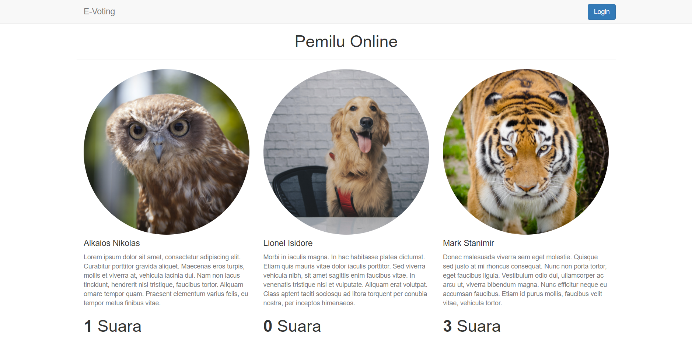
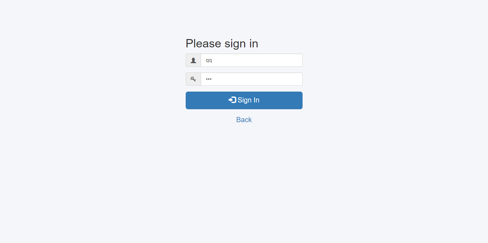
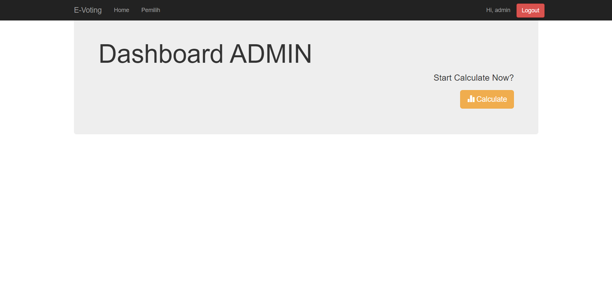
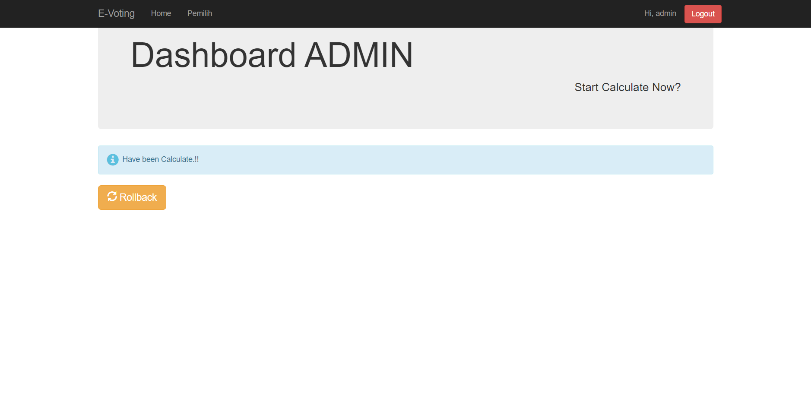
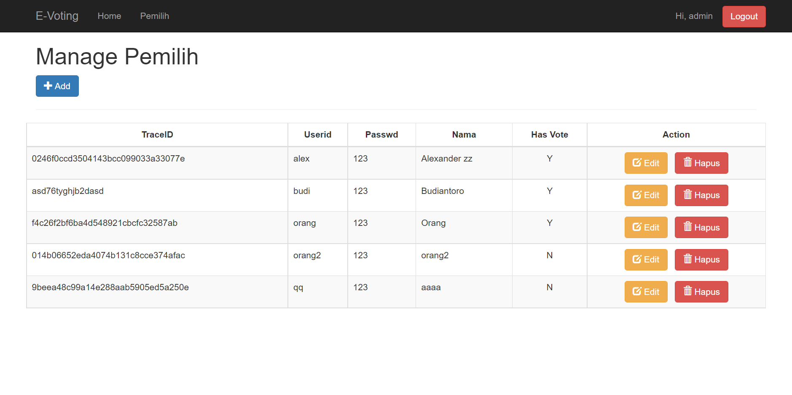
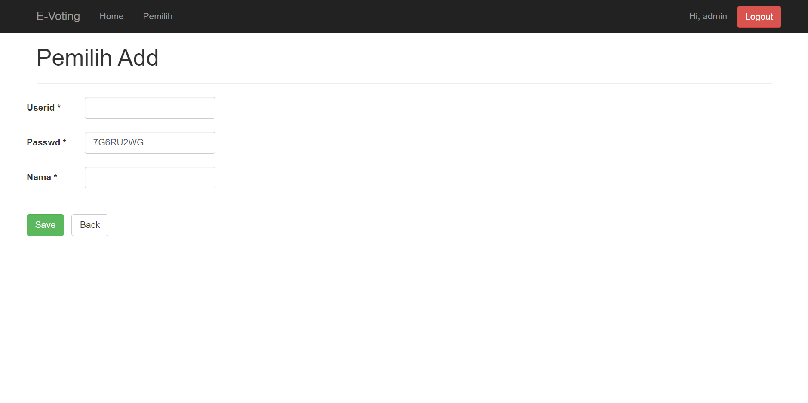
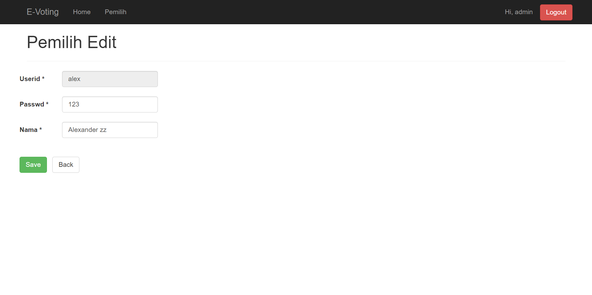
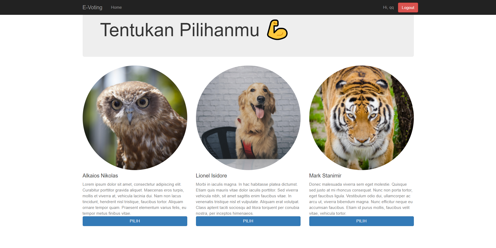
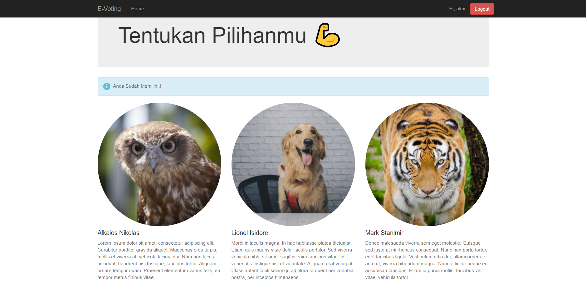

# E-Voting

#### E-Voting Web
Suitable for Beginners who want to dive deeper into **Java**
## Built With
* [Java](https://www.java.com)
* [JSF](https://www.oracle.com/java/technologies/javaserverfaces.html)
* [Hibernate](https://hibernate.org/)
* [Bootstrap](https://getbootstrap.com)
* [JQuery](https://jquery.com) - duh
## Installation
- import **db_evoting.sql**
- config your connection in **hibernate.cfg.xml**
- import requirement JAR (**MysqlConnector.jar**, **BootsFaces.jar**)
- **Test Drive**
## Screenshot

### Index 

### Login 

### Dashboard Admin 

### Dashboard Admin after Calculate 

### Manage Pemilih 

### Add Pemilih 

### Edit Pemilih 

### Dashboard User 

### Dashboard User after Choose 
